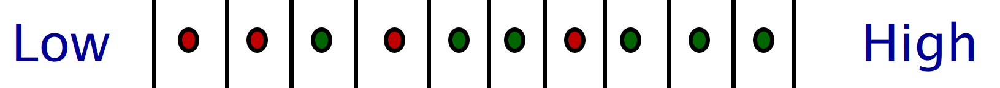
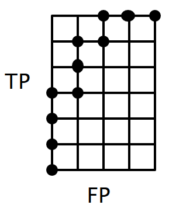

---
Peter Feghali @ Spring 2019
UCSB `CS165B` Final Study Guide
---
#### Introduction:
This is an incomplete final study guide.
There is probably material missing from here, albeit most information should be valid.
Do not expect substantive proofs, that's not what this is for. This will be continously updated as the course progresses.
Please email me if you'd like something updated or changed.
---
##### *All code blocks are mine unless otherwise noted, and might have errors/be suboptimal. I will be using pseudocode. Other documents and references will be linked to. Sorry about the typos, and excuse my math notation.*
---

# What is ML
Defined in the lecture as: "Machine learning is the design and analysis of algorithms that improve their performance at some task with experience".
ML is defined not only by the algoithims, but particulary the power of the applications it has. We use the term learning quite loosely here.

## Tasks
We define a task as a peice of work that the algorithm is designed to complete. The task must be well defined before working on any machine learning problem, as your task definition defines the type of model and feauture engineering required.
Some examples of tasks are classification, predicting a given output via a set of input data, etc. You can think about a task in the same way you as a human would view a task - What am I being asked to do?

## Experience
Experience is the set of data that you use to build your model. This data can be in any form, and should optimally be highly correlated to your expected outpt, or have enough intrinisc information to properly map to an output when multiple sources are combined. It is important to recognize "Garbage In -> Garbage Out" - Having good input data is a necessity to having a good model. Throwing a bunch of bad data to a neural network may give you an output, but truly, if your data isn't good you should reaxmine your problem domain and find a better way to work with your task at hand.

## Features
Sometimes your input data might seem like garbage, until you work with the data. Different than data 'massaging' to get an optimal output, features are the set of inputs that you give to your Machine Learning model. Sometimes these are the same as your orginal data points, but they do not have to be.

### Feature Engineering
Feature engineering is the process of applying proceeses to data to extract useful information and disseminate what matters from a dataset, to then feed into a model. While it is true, that (large) models could (and should) theoretically learn feature engineering on their own given enough time, there is almost always no good reason to not conduct the feature engineering beforehand, and optimize the learning process.

## Performance
Performance is determining how effective ones model. After training (or during, to continously evluate overall performance), models or tested on a set of previously unseen testing data, to verify whether or not the model actually learned anything. This set of testing data is usually a randomly chosen set of the testing data, held out from training. This is integral to achieving high performing models, as verifying performance with a seperate dataset allows for the mitigation of error and overfitting.

## Models
Models are the tools that we use to conduct machine learning. Choosing the right model and knowing which to use in what use case, is a fundemental skill. Tools such as AutoML help optimize this process, but as ML engineers, understanding a problem and model behavior rather than just throwing raw computing power against a problem is important. Disseminating when regression should be used or a decision tree, is important. While both may be effective for the problem you're trying to solve, each has inherit advantages and disadvantages.

## Online vs Offline Learning
There are two overarching types of learning, online and offline learning. Offline learning is significantly more common, which is utilizing a set of predetermined data points to train a model, then verifying performance, and applying it to a real problem. This model is then fixed with defined weights, and is usually never retrained. Online learning is the process of taking a ML model and putting it into the world, then having it make decesions while evaulating performance live. This allows for the continous learning of a problem with an increasing array of data, but may not be easy to work with.

# Types of ML
There are 4 main types of ML. These categories define the type of models and algorithims used to trian.

## Supervised
Supervised Learning is when the input data is well deined and lebelled. The input is mapped to a correct corresponding output, and there are no unknnown variables in the data. This is usually the most easy to work with, with high levels of complexity when dealing with hard problems. Particularly, you may not have enough data, which is where semi-supervised learning comes in.

## Semi-Supervised
Semi-Supervised learning takes place when a user has a set of data that is labelled, and a (usually) much larger set of data that is unlabelled. Lets imagine the problem of mapping ocean floor. We may have limited data that we've seen and labelled, but we have massive tranches of data that may simply be too much data to label. This is an extremely commonn problem.

## Unsupervised
Unsupervised learning is when a user has a set of data points with correlation, but no necessary labelling. My favorite example is word2vec. Imagine a data set full of news articles in French, and you were told to explain what 'autre' means, but in connotation, not simply in definition. Obviously connotation is not intrinsically in the definition of a word, but comes from its context, and is nearly impossible to derive in a vaccum. Word2vec looks at the context of words to derive a symantic meaning, which is then mapped to a vector space. This aloows for the comparison of different words and their meaning as vectors, and is a new way of lookng at language that would have been nearly impossible with simply labelled datasets.

## Reinforcement learning
Reinforcement learning is the utilization of experience to learn. An engineer allows a model to reck havoc in some sort of enviornment, just knowing its output space and a set of inputs. It then has to get a reward for completing a task. The agent has no knowledge of what the task is beforehand, and must learn it from scratch by improving its reward. This method of learning is solely through exploration, and has achieved superhuman performance at a variety of problems. It is computationally expensive, but unbelievably effective.

# Key ML Tasks
Machine Learning tasks can be put into a few categories.

## Predictive vs Descriptive
Models can generally be split into two categories, predictive or descruptive models. Predective models are characterized by whether or not they have an output variable which contains the target variable. If the model output contains the target variable in some sense, then it is considered a predictive model, and otherwise it is considered a descriptive model.

## Tasks:
Tasks are the sort of things we can make ML models do. What is the difference between a model that classifies fruits and vegetables, and a model that classifies rocks and potatos? Other than the weights and paramaters and such, they are both fundementally a binary classification task.
Due to inherent forms of problems, we can disseminate the main type of tasks that ML models will need to accomplish.

### Classification
Classification tasks are when a model is asked to classify an input as some pre-defined output class. [If there are two potential outputs, then the problem can be considered binary classification.](https://www.youtube.com/watch?v=ACmydtFDTGs) This can be generalized to K-Class Classification, where an input can be mapped to K classes.

### Clustering
Clustering is an unsupervised learning task where data points are mapped from a feature space into a secondary vecor space. In this vector space, points are clustered into a number of learned categories.

### Regression
Regression is the mapping of a n-d feature space to a real valued output or set of outputs.

### Dimensionality Reduction
Dimensionality Reduction is the process of taking a set on inputs in a n-d feature space, and reducing that space to a corresponding output, while retaining relvatnt information. Examples of this can be seen with simple redction of redundant features, and more usefully, with encoder models to simplify some sort of an input to an output which can be easily used and contains desirable features.

### Anomaly Detection
Anomaly Detection is the utilization of some sort of model to recognize when an inconsistency occurs. I am not very familiar with this.

# Types of ML models
ML model types can be put into one of three regimes, which define how the model determines its output. It is important to recognize that models may fall into multiple categories, depending on ones interpretation of them.  
I quite like this image:

### Geometric Models
Geometric models are constructed in the instance space, using hyperplanes or other geometric methods. Common geometric models are linear classifiers and SVMs.

### Probablistic Models
A probabilistic model is one which outputs a targer variable representing the likeihood that an input x maps to class y. More generally, it is any model which utilizes the input feature space to find probabilities, rather than a specific decision. These can easily be mapped to classification problems, for example, as one can simply argmax(:) the outputs of a k-class-probability model.

### Logical Models
Logical models are models which used a rule based approach to decide their output. Commonly, decision trees learn a set of rules from the input data. These methods are advantageous due to excellent performance and easy comprehensibility. 

# Generalization vs Overfitting
Generalization is when one has a model which has well modelled the true underlying function you are trying to estimate. Overfitting is the inverse, which is when your model does too good of a job, and gets 100% on all of your training data, but fails on any real data. This is known as overfitting, as your model has optimized itself for the training data in too strong of a manner. Common signs of overfitting are when a) a model works on its first try or b) you see accuracy above 99% (except for MNIST).

# Intrinsic Dimensions
I quite like [Wikipedia's defintion](https://en.wikipedia.org/wiki/Intrinsic_dimension): "...How many variables are needed to represent the signal. For a signal of N variables, its intrinsic dimension M satisfies 0 ≤ M ≤ N." The intrinisc dimension of a set of features is the minimum number of dimensions needed to properly display a signal.

# Inductive Bias
Inductive bias is the inherit bias of your model. It is the set of assumptions that are made to solve the problem at hand, either assumed by the model designer, or the model during training. This bias is usually in a form which optimizes for minimal complexity. At a base level this can be thought of as a thought process to design methoda and models that reduce overfitting. Truly, the reaso this is such a valid method to model complex systems, in addition to the obvious, can be understood in more depth [here](https://arxiv.org/abs/1608.08225). Essentially, Nature is fundementally not *that* complex. Therefore NN and ML is actually a pretty darn good way to describe natural phenomena and other processes, and we really do not need super complex models to solve *most* tasks. So in other words, a simple model can properly learn complex behavior -> we can rely on a subset of all possible data to extrapolate to a true funtion -> inductive bias.

# The Curse of Dimensionality
The curse of dimensionality is fundementally a sparsity problem, where an input training space can be too large given a number of features, and therefore it can be easy to fail to have enough density in training data to train a model effectively. As the number of input features increases, the amount of training data needed increases exponentially. Using methods such as feature selection can help choose the optimal model input features. The book mentions using PCA to simplify the input space as well.

# Norms (Distance Measures)
We utilize norms to measure the distance between data points in space. Common norms are the L2 norm, which is commonly seen in the form A^2 + B^2 = C^2. As well, the L1 norm, also known as the manhattan distance, is simply the summation of the difference between coordinate axes.  
For a norm *N* with *D* dimensions, we can define the Norm between two points *A* and *B* as:  

# Contingency Plots
A contingency plot is a table which represents the distribution of a classified otuputs into some sort of a plot given the input classes and the predicted outputs. In this case, we will focus on the plots as defined in the Professor's presentations, rather than in the book.

### True Positive
The true positives are the examples that have been classified correctly, in the positive class (or more generally, in the class we are considering positive. Note that this may seem redundant, but this distinction is important when determnining contingency tables for multi-class problems).
### False Positives (Type I Error)
False positives are examples that have been misclassifed as positive, but actually should be false.
### True Negatives
True negatives are the set of input examples that map to a negative input classification accurately.
### False Negatives (Type II Error)
False negatives are the set of true examples that have been mapped incorrectly as false.
### Accuracy
Accuracy is defined as defined as the number of true positives and true negatives over the true number of positive and negative examples. In other words, this is the number of correctly classified examples over the total.
### Precision
Precision is defined as the number of True Positives over the count of True Positives and False Positives.
### Error Rate
Error Rate is the number of False Positives and False Negatives over the total number of examples.
### Recall / Sensitivity
Recall is synonymous with the True Positive Rate and Sensitivity, True Positives over the number of actual positives.
### Specificity
Specificity is synonymous with the True Negative Rate, True Negatives over the the number of actual negatives
### F1 Score

### TP/TN/FP/FN Rate
For all the rates, just take the value you want to find the rate off, then divide it by the actual number of positive or negative examples.
# Accuracy vs Precision vs Recall
All of the above are fundementally different objectives, and are well suited as performance metrics for a variety of tasks. While they can (and should!) be used as performance metrics by analyzing all three simultaneously, understanind what each represents is important to finding an optimal model.
## Deciding what you want and why
Accuracy is a good overall metric to measure performance. Accuracy gives a good view of the performance of a model, but fails to capture the details as to how the classifier leans. Precision measures how confident a user can be in a predicted positive output. This is important in situations where being right matters more than getting the right anwser every time. Recall represents how well the classifier gets positive anwsers correct. This ignores false positives, and gives the user the rate at which the classifier measured the positive examples correctly. This is representative of when a user wants to catch every possible case of an input, even if it might be wrong.
# Coverage plots / ROC Plot
  
Coverage plots are plots which measure the number of true positives and false positives in relation to the number of positive and negative examples. They allow simple comparison of classifiers in a visual way. The optimal modesl are on the top left, and the worst are on the top-right (or anywhere on the diagonal between the origin and top-right). ROC plots are the same thing, but they're square. The axes are 1x1, normalized by the number of samples such that any plotted points are representative of true positive rates and false positive rates.
# Basic Linear Classifer
A linear classifer is the process of finding a hyperplane to seperate data and be able to classify whether or not an input is part of category A or B. This can be thought of as solving the equation `a(x1-x1_0) + b(x2-x2_0) + c(x3-x30) + ... = 0` for all coeffecients. This can be solved by solving for the coeffecients `{a, b, ...}` and for the bias `{a*x1_0 + b*x2_0 + ...}`. The coeffecients and bias can be solved for by taking dot products. The bias is the dot product of the vector between two centers and the average vector of the two. The coeffecients are simply the vector between the two. Therefore solving the classifier requires taking the averages of the centroids, finding the vector between them, and taking dot products. This method is extensible to N dimensions.
# Scoring Classifiers
Scoring classifers produce some sort of score, which then is usually returned in combination with a prediction about waht the output is. Given an input, output a score for each of the K classes. Normally, the score is normalized to zero, with negatives indicating a negative class.
## Margin
The margin is usually also the score. The margin is defined as `z(x) = class(x)*score(x)`. The corresponding score function is some function which maps the input to some output confidence level. A good function would be some function which retains sign, such as an L1 norm.
## Loss Functions
A loss function is a function which is used to tell some sort of a model how good of a decision it made. For example, one could penalize a model every time it gets an anwser wrong with a penalty of 1, and 0 if it is correct. While this would work, certain examples far from the decision boundary may not be taken enough into consideration. We cna use other loss functions that scale with distance to better optimize our optimization process such that the model converges.
### Minimizing Overfitting with intelligent loss function choices
By choosing your loss function intelligently, you can minimize overfitting and get a more stable model. Certain loss functions are designed to penalize correct solutions as well, if they are too close (or far) from the boundary. It is easy to imagine extranneous behavior for loss function design that may fit better for some problems than others. 
# Ranking Classifiers
Ranking classifiers are useful for determing the ordering of some set of data points. This method is fairly robust to noise or other errors. The output of the classifier should have all of the positive examples ranked higher.
## Error Assesment
We define a ranking error as a single pair in which a negative exampleis ranked higher than a positive example. In addition, if their a tie, we count such an error as .50.
### Ranking Error Rate
The ranking error rate is computed by dividing the number of errors by the number of positive data points * negatives.
### Ranking Accuracy
The ranking accuracy is 1 - Ranking Error Rate
## Coverage Curves

If we imagine each line between data points to be a single decision rule, we can see that each decision rule has different performance. As we move the decision line from high to low, we can count the number of positive predictions and false positives.  
By counting each, we can form a coverage curve, which represents how a moving decision boundary affects classification performance.  
  
We can then count the area under the curve, and divide it by the total size, to give us the accuracy of the classifier. The plot above is known as a coverage curve, and if we normalize the graph to 1x1, then we get ROC curve. The area under the ROC curve is equivalent to the ranking accuracy. 

# Class Probability Estimation
A scoring classifier which outputs probabilities over K classes, where the probabilities must add to 1.

# Empirical Probabilities
Empirical probabilities are essentially just the relative frequency of data.
### Relative Frequency
Given N instances of a class in a training set S, N/S = P  
This method is obviously not perfect, as a training sample is not representative or the real world. Some examples may not be shown in the training samples that do exist, and others may be shown too much. There are certain methods to correct these potential pitfalls.
## LaPlace Correction
LaPlace Correction is done by adding a single example to each class, then dividing by the total number of samples and the number of classes: `(N_i + 1)/(|Training Set| + |Classes|)`
## M-Estimate
M-Estimate uses a set of priors to adjust the probabilites to a consistent state. Given that a set of data has a prior distribution p, and pseudo-counts m, for each example i we can apply the M-estimate function: `(N_i + m*pi_i)/(|S| + m)`

# PAC Learning
PAC stands for Probably Approximately Correct. As taken from the slides, "If a concept is PAC-learnable, then there exists a learning algorithm that gets it mostly right, most of the time".  
Define a hypothesis h in a space H, and a distribution of data D. Allow for an error rate of h for the distribution D: err_d. Allow some sort of error e, and allow a failure rate s. PAC learning outputs, with a probability at least 1-s, a hypothesis h such that err_d < e. These statements lead to the most of the time and mostly right statements.  
This can actually become a guaruntee, given a large enough training set m = |D|.  
The given equation was: `m>=(1/e)(ln(|H|) + ln(1/s))`

# VC Dimension
The VC dimension is an attempt at measuring the capacity of a space of functions that can be learned from statistical classification. This is defined as the largest set of points that an algorithm can shatter.

# MAP Decision rule

# Regression Models
Regression is the process of taking some set of points and fitting some sort of a function to those data points.

## Residual Error Optimization
Generally, regression focuses on the minimization of some sort of loss function.  
The resdual is defined as the difference between the actual label of some data point and its predicted value. This value is then optimized on by different types of regression.

## Linear Least Squares Regression
Linear least squares regression refers to the process of minimizing the sum of the squares of the residuals.

### Univariate
So lets say we have a set of data points, with an input and an output. Since there is a single input variable, this is considered univariate. Lets consider these data points as (h, w). This can be parameterized as w = a+bh, with a being some sort of bias term, and b being the slope of the learned line.  
Effectively, we then can expand this to a general form, where the output function to estimate w given some sort of h input would be `w=average(w)+(covariance(h,w)/variance(h)^2)(h-average(h))`. This function effectively begins by noralizing any sort of input variable, then estimating its output slope based on its covariace and variance, then adding the output bias.

### Multivariate
Multivariate linear regresion is essentially the same idea, but now with a bunch more paramaters. With homogenous coordinates this is a fairly trivial solution.  
Consider learning a weight vector defined by `w' = (X^T * X)^-1 * X^T * y`. This leads to the process of solving this problem with the form `y(X) = w'^T * X`. In this case, X has the inputs as row vectors.  
If X is column vectors, then we redefine these equations such that `w' = (X * X^T)^-1 * X * y`

### Least Squares Classifier
This can be done by encoding the classes as real numbers, then learning some sort of regression function, and thresholding the output. While this could work, generally, don't.

## Regularization
Regularization can be applied to regression problem to help minimize terms that explode. We minimize large coeffecients with regularization functions similair to `r(w)=||w||^2`. We minimize across the weights such that if any coeffecients are too large they are penalized.

# The Perceptron Model
The perceptron aims to solve the problem of finding the right solution to a given problem. Given some sort of data which is actually seperable, and a true solution exists, the peceptron model will find it. At a high level, the perceptron fits over errors until there are not any. The update rule is `w' = w + nyx`.

## Perceptron Dual Form
Every time a training example is misclassified, nyx is added to w. As training continues, any example has been misclassified a_i times.

## Classifier Margin
The margin for some point is a sample's distance from the decision boundary. This can be computed with `(y(w^T * x - t))/||w||` (non-homogenous)
Given that you can seperate these data points in one way with some line, there must therefore be an inifnite number of ways to do so. Which is the best?

# Support Vector Machines
Rather than simply trying to optimize against mis-predictions, what if we optimized for the margin?
Turns out this methodology is a constrained optimization problem, which can be solved via lagrangian multipliers.  
First, we maximize `-1/2(sum_i(sum_j(a_i*a_j*y_i*y_j*(x_i . x_j)))) + sum(a_i)` over all the a_i terms  
We then set `w = sum(a_i*y_i*x_i)`
We solve the the threshold with `1 = w^T * x_i - t`  
Sometimes it makes sense to do a soft-margin SVM, such thaat some errors are allowed during the optimization. We add an error term to the minimization problem, which sums over all of the errors, with some sort of multiplier determining that term's importance. This is generally an important thing to do.

# Trees

## Decision Trees
Decision trees parition the instance space, leaving sets of hypotheses. Ecah leaf is a conjunction of all of the literals on its path. This is extremely useful for explaning how a decision was made. Ideally, each leaf has no impurities during training. These can overfit easily, unless certain methodologies to reduce overfitting are used. First consider limiting branching depth, which will make sure that a model does not overfit on all sorts of input noise. Similairly, the model can be used in conjucntion with a number of other models such that some sort of a 'forest' of trees can be made. This, in conjunction with other optiization methods, leads to the concept of a random foest classifier, which takes a number of trees, averages them, and decides an output.

## Ranking Trees
We can make a decision tree into a ranking tree by ordering the leaves. We can do so by impurity, and it usually makes sense to do some sort of smoothing on the output tree.

## Probability Estimation Trees
Solve for empiraical probabilities for each leaf, and show the probability. Once again, applying some sort of correction is usually good practice.

### Impurity
Training these trees requires a comprehension of what a good split on a feature is. In this case, that is decided by the amount of impurity any particular eature choice leads to.  
Impurity is some sort of a function which should be maximum when the output split is essentially random, and should be minimized hen the output is homogenous in its classification.  
These functions are dpeendent on calculating (in the binary classification problem) `p'= Positive Examples / (Positive Examples + Negative Examples)`  
Then the imurity for a leaf can be calcuated with a set of functions. Common functions are: 
* Minority class: `min(p',1-p')`
* Gini Index: `2p'(1-p')`
* Entropy: -p'log_2(p') - (1-p')log_2(1-p')
* Squareroot(Gini Index): `(2p'(1-p'))^.5`  
For more than k classes, consider these generalized impurity functions:
* k-class Entropy: `sum_over_classes(-p'*log_2(p'))` where p' is calculated on a per class basis, as the class's examples over the resulting total.
* k-class Gini index: `sum_over_classes(p'(1-p'))`

### Best Split algo
Pick a feature, measure the impurity. Would another feature be better? Fit and minimize.

# Stats

### Mean
Sum then divide over #. Integrate over probability * value. Expected value. etc.

### Variance
variance = Expected Value of a variable^2 - mean^2.
Std. Dev = squareroot(variance)

### Covariance
Expected value of (var_1 * var_2) - mean_1 * mean_2

## Bayes Rule
`P(A|B) = (P(B|A)P(A))/P(B)`

## Gram Matrix
`X^T * X`

# Kernel Trick
So our percetrons and such have limited capacity since we're dealing with models which are fundamentally trying to learn some sort of linear model. The idea is to change our data points such that we end up with linearly seperable data points. The idea is to just replace thre dot product with some sort of valid funtion, which does the same sort of thing, but outputs a value transofofrmed into in a new instance space.

# Nearest neighbor classifiers

## Standard Nearest Neighbor classifier
classification of any value is just the same as whatever the closest training example is. Closest is defined based on some given distance metric.

## k-NN
Instead of just looking for whatever the closest point is, it is more effective to take some number of points closest to a value, and take the argmax of those to determine the class. This voting can be a simple argmax, or some sort of more complex voting.

# Clustering
The goal of clustering is to cluster data points that have high dimeensionality, to some sort of low dimensional space.  
To achieve this goal, it traditionally focuses on two principles, minimizing within cluster distance, and maximizing between cluster distance. 

### Scatter Matrix
Lets say that X is a matrix that has zero-centered samples as row vectors, then `S=X^T*X`. You can also compute the scatter matrix by subsecting the data, and writing the matrix as a sum of those individual portions of the data. `S = sum(S_i[<- Subset scatter matrices]) + B[<-Scatter matrix of partition means]`

### Scatter
The scatter is the tarace of the scatter matrix. The trace is the sum of the diagonal elemeents of the matrix.

## K-Means Clustering
This is a NP-Complete problem. The k-means algorithim isn't too poor, but won't converge to the optimal solution most of the time. Rather, we run it a few times with random seeds, then choose the best. 

### Algo
1. randomly initialize K vectors for K classes.
2. Assign each x to a data point, which is then minimized in relation to the cluster means.
3. For each class, take this value and assign it to the corresponding cluster and redefine the mean.
4. Repeat from step 2 until there is no (or very little) change in the cluster means.

### Medioids
Rather than simply computing a mean within the instance space, sometimes it makes more sense to use data points as exemplars. The medoid is the point with the minimal average dissimilarity to all other points within the set. This can be easily done by recomputing cluster medioids rather than means during step of the algo above.

### Kernel K-Means
If we replace our distance measurement with some sort of kernel measurement, then we can recompute our distance in a preferred manner to get a better clustering.

# PCA and Eigendecomposition
`PC_1 = argmax(y^T * X)(X^T * y)`
These methods are etremely useful techniques for decomposing some sort of input into requisite parts. For example, given a chaotic dataset, you could use PCA to remove some sort of overwhelming skew from all of the data points.  
As well, the eigenvectors of S are the prinipal components of the data, ordered by decreasing eigenvalues. The largest is the first principal component. These eigenvectors can be thought of as basis vectors.  
This is a short section, but tremensdously important and applicable.

# Model Ensembles
We can combine models to increase the performance. While they increase complexity, they also increase performance. Some of the most common methods are bagging and boosting.

## Bagging (Bootstrap Aggregation)
Bagging is the process of creatibng T models on different random samples of the training data set. Those samples are made with replacement, and those are used to train sets of models. Those are then combined, and the differences between the models make up the ensemble. This then ends up producing some sort of piecewise linear model (assuming linear models).

## Boosting
Creates more diverse training sets than bagging, and focuses on selecting classifers that do better on misclassifications.  
"As long as the performance of each classifier is better than chance, it is guaranteed to converge to a better classifier"

### Methodology
Train a classifier, and assign it a confidence factor based on its error rate. Do so for T classifiers. The ensemble predictor is the resulting weighted average for the models.  

Generally more effective at getting a comprehensive model set than bagging.

# Performance Measures and Experiments

## Cross Validation
1. Randomly partition the data into K folds
2. Train the model on k-1 folds
3. Test the data on the remaining fold
4. Repeat the process for each test fold, then average the results

This is known as k-fold cross validation. Generally each fold should have at least 30 instances. For larger datasets, less folds are probably needed, while for small datasets, leave-one-out may be best.  
The results of this process also tell us about our data. If the variance between models is too high, you probably need more data.

## Errors
Training error should always be low. If the training error is too high, that is a sign that reevaluatng your model is necessary and it is not converging. Changing hyperparamaters would be a good decision, if not reevaluating your model entirely.  
If the validation error is too high, your model is proabbly overfitting. There may be too many paramaters. It may be worth looking at dynamic learning rate adjustments. Changing hyperparamaters is probably the first solution to look at. 
Testing error will almost always be higher than the validation error. If it is too high, recollect data, reconsider your type of data, etc. It should not be absurdly higher than your validation data. 

# 'Neural' Networks

#### Why the '' around neural?
Are neural networks really biologial or anything like neurons? No, but that is okay. They are so effective due to massive fan-in and fan-out capability, in addition to non-linearities, but that does not make them neurons. SNNs are the closest we have, and those are currently in a chicken and egg stage with hardware. It is easy to overuse the term, but that does not make it more valid.

## ANN - Artificial Neural Networks
ANNs are sers of elements that form a network, which then can process inputs and learn some sort of function. networks are generally consructed to have learned weights, and are used to approximate inherently non-linear functions. From data, these models are designed to learn sets of weights (and sometimes architectures too!).

## Linear Perceptrons
They are a sum of weighted inputs with some sort of an activation function.

## MLP - Multilayer perceptron
 A two layer MLP can approximate any function. (Terrible idea, but you could do it!)  
 When talking about multiple layers, we're just stacking these functions on top of each other to get increasingly well-connected layers.

## DNN - Deep Neural Networks
Fully connected feedforward networks. You've got a bunch of hidden layers inbetween the input and output, and the output then is thresholded and the most prominent output is chosen. DNNs can be expressed in terms of a matrix equation filled with non-linearities and whatever else.

## Why non-linearities?
There are some intuitive ways to look at why the non-linearities are important for DNNs.  
I'd imagine some sort of complex layer structure. Attempting to use this layer structure to approximate some sort of continous problem, or highly non-linear function, is really hard. A big part of why that is hard, is selectivity. If we had no non-linearities, then every single weight would be fundamentally important to the output of the network. What non-linearities allow is slectivity in features. If there is some feature that becomes negative in some layer, rather than having to train and learn some weight vector with that data, the non-linearity cleans that data point and removes its importance. This allows for selectivity in our model, as it can choose to ignore certain vectors if they are learned to be unimportant. This leads to a form with learned selective importance intrinsically in the weights, which allow for highly selective functions with a massive capacity.  

# Learning and Deep Learning
The primary idea of these learning methods is learning a function through gradient based learning. inotw, a minimization problem.  
Given some sort of loss function and paramter set, how to we minimize our loss function?
1. Brute force - works every time.
2. Calculus - I guess this works sometimes too.

## Gradient Descent
Gradient Descent as an optimization method for learning the optimal state for the model.  
Update rule: `theta' = theta - learning_rate*gradient(loss_function(theta))`  
This update rule works with sets of paramaters too.

## Stochastic Gradient Descent
Pick some training sample k.
Then update rule: `theta' = theta - learning_rate*gradient(loss_function_k(theta))`
The model then can be constantly updated.

## Epoch
An epoch is one pass over the training data.

## MiniBatch SGD
Rather than training over a single example, or the entire dataset, pick a set of B training samples as your batch. Then use that set during each batch. This helps the model train faster due to less time updating small steps with one example, and more effecient than optimizing over every possible error.

## Dropout
Randomly set some paramaters to 0. This helps make models significantly more robust.n While it does cost an increase in training time, it is absolutely worth it.

## Backprop or: How I Learned to Stop Worrying and Love DNNs
Basic of derivatives on computational graphs. Two rules to keep in mind
1. Sum over all possible paths between two nodes
2. Multiply the derivatives on each edge of the path together

You can then do reverse mode differentiation to look at how any of the inputs should change in response to some sort of desired change in the output. Backprop works by propogating erros backwards from the output.  
For each input training example, propogate it forward. Then after computing the output, propogate errors backward and calculate error terms. Update each weight accordingly `w_ij = w_ij + lr*err*input_from_i_to_j`. Continue to convergence.  
Backprop leads to smooth interpolation between datapoints with the same label.

## Activation Functions
Different types of activation functions:
* Boolean
* Linear
* Non-Linear
* Bounded
Some exmaples: unit steps, sign, linear, perice-wise linear, logistic, tanh, relu  
Relu is very common, `max(x,0)`.

## RNNs
So what do we do if we have temporal information?
1. Be lazy, cheat, and just use an MLP with extended inputs for diferent time periods (this works well, generally recommended).
2. Use an RNN for variable length inputs and other benefits

RNNs allow you to learn a general model for temporal inputs that are dependent on previous instances of time. An RNN passes along the information in the hidden layer. `h_t = activation(W*h_(t-1)+Ux_t)` `output = softmax(V*h_t)`.  
I like what Wang mentioned in class, essentially just unfold the network's loops and make it look linear. There is now an interdependence on the previous state and your current state, as it acts as another input.

# Other

  
[Common ML optimization techniques are applied to other fields too!](http://cotty.16x16.com/compress/fractcpr.txt)