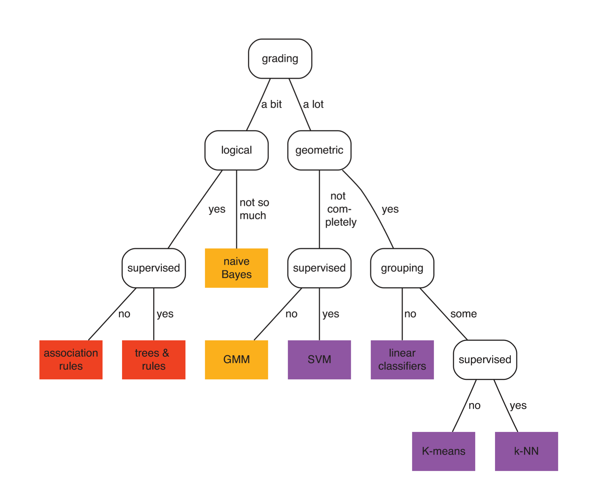
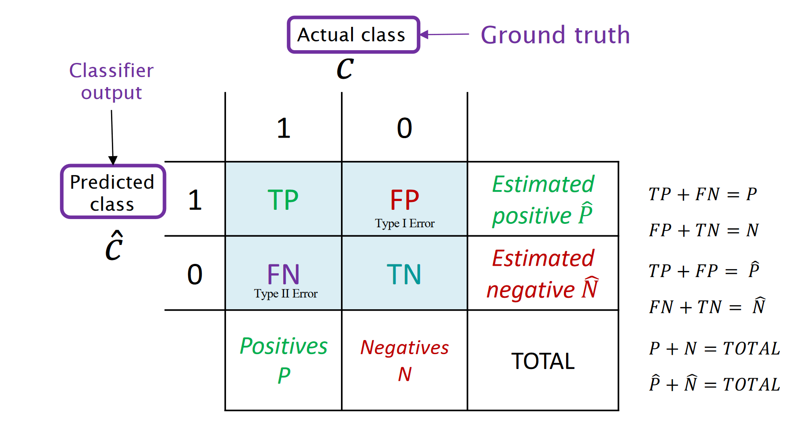
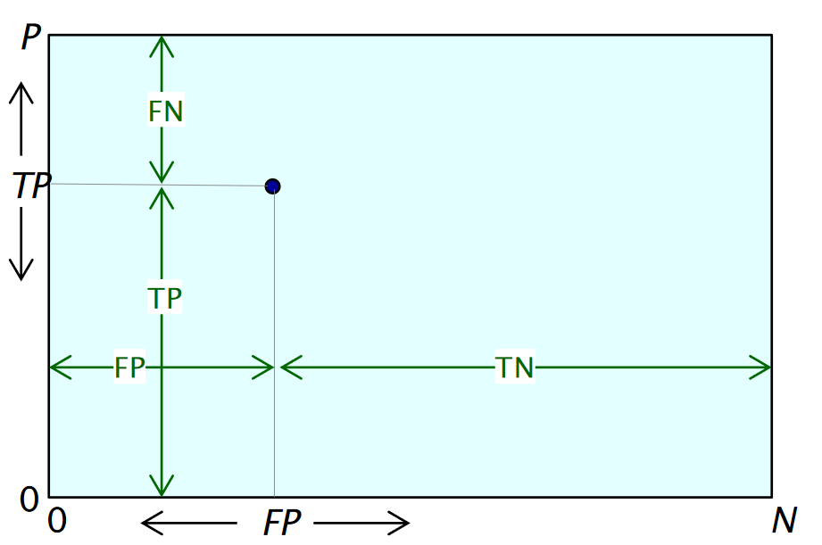

---
Peter Feghali @ Spring 2019
UCSB `CS165B` Final Study Guide
---
#### Introduction:
This is an incomplete final study guide.
There is probably material missing from here, albeit most information should be valid.
Do not expect substantive proofs, that's not what this is for. This will be continously updated as the course progresses.
Please email me if you'd like something updated or changed.
---
##### *All code blocks are mine unless otherwise noted, and might have errors/be suboptimal. I will be using pseudocode. Other documents and references will be linked to. Sorry about the typos.*
---

# What is ML
Defined in the lecture as: "Machine learning is the design and analysis of algorithms that improve their performance at some task with experience".
ML is defined not only by the algoithims, but particulary the power of the applications it has. We use the term learning quite loosely here.

## Tasks
We define a task as a peice of work that the algorithm is designed to complete. The task must be well defined before working on any machine learning problem, as your task definition defines the type of model and feauture engineering required.
Some examples of tasks are classification, predicting a given output via a set of input data, etc. You can think about a task in the same way you as a human would view a task - What am I being asked to do?

## Experience
Experience is the set of data that you use to build your model. This data can be in any form, and should optimally be highly correlated to your expected outpt, or have enough intrinisc information to properly map to an output when multiple sources are combined. It is important to recognize "Garbage In -> Garbage Out" - Having good input data is a necessity to having a good model. Throwing a bunch of bad data to a neural network may give you an output, but truly, if your data isn't good you should reaxmine your problem domain and find a better way to work with your task at hand.

## Features
Sometimes your input data might seem like garbage, until you work with the data. Different than data 'massaging' to get an optimal output, features are the set of inputs that you give to your Machine Learning model. Sometimes these are the same as your orginal data points, but they do not have to be.

### Feature Engineering
Feature engineering is the process of applying proceeses to data to extract useful information and disseminate what matters from a dataset, to then feed into a model. While it is true, that (large) models could (and should) theoretically learn feature engineering on their own given enough time, there is almost always no good reason to not conduct the feature engineering beforehand, and optimize the learning process.

## Performance
Performance is determining how effective ones model. After training (or during, to continously evluate overall performance), models or tested on a set of previously unseen testing data, to verify whether or not the model actually learned anything. This set of testing data is usually a randomly chosen set of the testing data, held out from training. This is integral to achieving high performing models, as verifying performance with a seperate dataset allows for the mitigation of error and overfitting.

## Models
Models are the tools that we use to conduct machine learning. Choosing the right model and knowing which to use in what use case, is a fundemental skill. Tools such as AutoML help optimize this process, but as ML engineers, understanding a problem and model behavior rather than just throwing raw computing power against a problem is important. Disseminating when regression should be used or a decision tree, is important. While both may be effective for the problem you're trying to solve, each has inherit advantages and disadvantages.

## Online vs Offline Learning
There are two overarching types of learning, online and offline learning. Offline learning is significantly more common, which is utilizing a set of predetermined data points to train a model, then verifying performance, and applying it to a real problem. This model is then fixed with defined weights, and is usually never retrained. Online learning is the process of taking a ML model and putting it into the world, then having it make decesions while evaulating performance live. This allows for the continous learning of a problem with an increasing array of data, but may not be easy to work with.

# Types of ML
There are 4 main types of ML. These categories define the type of models and algorithims used to trian.

## Supervised
Supervised Learning is when the input data is well deined and lebelled. The input is mapped to a correct corresponding output, and there are no unknnown variables in the data. This is usually the most easy to work with, with high levels of complexity when dealing with hard problems. Particularly, you may not have enough data, which is where semi-supervised learning comes in.

## Semi-Supervised
Semi-Supervised learning takes place when a user has a set of data that is labelled, and a (usually) much larger set of data that is unlabelled. Lets imagine the problem of mapping ocean floor. We may have limited data that we've seen and labelled, but we have massive tranches of data that may simply be too much data to label. This is an extremely commonn problem.

## Unsupervised
Unsupervised learning is when a user has a set of data points with correlation, but no necessary labelling. My favorite example is word2vec. Imagine a data set full of news articles in French, and you were told to explain what 'autre' means, but in connotation, not simply in definition. Obviously connotation is not intrinsically in the definition of a word, but comes from its context, and is nearly impossible to derive in a vaccum. Word2vec looks at the context of words to derive a symantic meaning, which is then mapped to a vector space. This aloows for the comparison of different words and their meaning as vectors, and is a new way of lookng at language that would have been nearly impossible with simply labelled datasets.

## Reinforcement learning
Reinforcement learning is the utilization of experience to learn. An engineer allows a model to reck havoc in some sort of enviornment, just knowing its output space and a set of inputs. It then has to get a reward for completing a task. The agent has no knowledge of what the task is beforehand, and must learn it from scratch by improving its reward. This method of learning is solely through exploration, and has achieved superhuman performance at a variety of problems. It is computationally expensive, but unbelievably effective.

# Key ML Tasks
Machine Learning tasks can be put into a few categories.

## Predective vs Descriptive
Models can generally be split into two categories, predictive or descruptive models. Predective models are characterized by whether or not they have an output variable which contains the target variable. If the model output contains the target variable in some sense, then it is considered a predictive model, and otherwise it is considered a descriptive model.

## Tasks:
Tasks are the sort of things we can make ML models do. What is the difference between a model that classifies fruits and vegetables, and a model that classifies rocks and potatos? Other than the weights and paramaters and such, they are both fundementally a binary classification task.
Due to inherent forms of problems, we can disseminate the main type of tasks that ML models will need to accomplish.

### Classification
Classification tasks are when a model is asked to classify an input as some pre-defined output class. [If there are two potential outputs, then the problem can be considered binary classification.](https://www.youtube.com/watch?v=ACmydtFDTGs) This can be generalized to K-Class Classification, where an input can be mapped to K classes.

### Clustering
Clustering is an unsupervised learning task where data points are mapped from a feature space into a secondary vecor space. In this vector space, points are clustered into a number of learned categories.

### Regression
Regression is the mapping of a n-d feature space to a real valued output or set of outputs.

### Dimensionality Reduction
Dimensionality Reduction is the process of taking a set on inputs in a n-d feature space, and reducing that space to a corresponding output, while retaining relvatnt information. Examples of this can be seen with simple redction of redundant features, and more usefully, with encoder models to simplify some sort of an input to an output which can be eaily used an dcontains desirable features.

### Anomaly Detection
Anomaly Detection is the utilization of some sort of model to recognize when an inconsistency occurs. I am not very familiar with this.

# Types of ML models
ML model types can be put into one of three regimes, which define how the model determines its output. It is important to recognize that models may fall into multiple categories, depending on ones interpretation of them.  
I quite like this image:

### Geometric Models
Geometric models are constructed in the instance space, using hyperplanes or other geometric methods. Common geometric models are linear classifiers and SMVs.

### Probablistic Models
A probabilistic model is one which outputs a targer variable representing the likeihood that an input x maps to class y. More generally, it is any model which utilizes the input feature space to find probabilities, rather than a specific decision. These can easily be mapped to classification problems, for example, as one can simply max(:) the outputs of a k-class-probability model.

### Logical Models
Logical models are models which used a rule based approach to decide their output. Commonly, decision trees learn a set of rules from the input data. These methods are advantageous due to excellent performance and easy comprehensibility. 

# Generalization vs Overfitting
Generalization is when one has a model which has well modelled the true underlying function you are trying to estimate. Overfitting is the inverse, which is when your model does too good of a job, and gets 100% on all of your training data, but fails on any real data. This is known as overfitting, as your model has optimized itself for the training data in too strong of a manner. Common signs of overfitting are when a) a model works on its first try or b) you see accuracy above 99% (except for MNIST).

# Intrinsic Dimensions
I quite like [Wikipedia's defintion](https://en.wikipedia.org/wiki/Intrinsic_dimension): "...How many variables are needed to represent the signal. For a signal of N variables, its intrinsic dimension M satisfies 0 ≤ M ≤ N." The intrinisc dimension of a set of features is the minimum number of dimensions needed to properly display a signal.

# Inductive Bias
Inductive bias is the inherit bias of your model. It is the set of assumptions that are made to solve the problem at hand, either assumed by the model designer, or the model during training. This bias is usually in a form which optimizes for minimal complexity. At a base level this can be thought of as a thought process to design methoda and models that reduce overfitting. Truly, the reaso this is such a valid method to model complex systems, in addition to the obvious, can be understood in more depth [here](https://arxiv.org/abs/1608.08225). Essentially, Nature is fundementally not *that* complex. Therefore NN and ML is actually a pretty darn good way to describe natural phenomena and other processes, and we really do not need super complex models to solve *most* tasks. So in other words, a simple model can properly learn complex behavior -> we can rely on a subset of all possible data to extrapolate to a true funtion -> inductive bias.

# The Curse of Dimensionality
The curse of dimensionality is fundementally a sparsity problem, where an input training space can be too large given a number of features, and therefore it can be easy to fail to have enough density in training data to train a model effectively. As the number of input features increases, the amount of training data needed increases exponentially. Using methods such as feature selection can help choose the optimal model input features. The book mentions using PCA to simplify the input space as well.

# Norms (Distance Measures)
We utilize norms to measure the distance between data points in space. Common norms are the L2 norm, which is commonly seen in the form A^2 + B^2 = C^2. As well, the L1 norm, also known as the manhattan distance, is simply the summation of the difference between coordinate axes.  
For a norm *N* with *D* dimensions, we can define the Norm between two points *A* and *B* as:  

# Contingency Plots
A contingency plot is a table which represents the distribution of a classified otuputs into some sort of a plot given the input classes and the predicted outputs. In this case, we will focus on the plots as defined in the Professor's presentations, rather than in the book.

### True Positive
The true positives are the examples that have been classified correctly, in the positive class (or more generally, in the class we are considering positive. Note that this may seem redundant, but this distinction is important when determnining contingency tables for multi-class problems).
### False Positives (Type I Error)
False positives are examples that have been misclassifed as positive, but actually should be false.
### True Negatives
True negatives are the set of input examples that map to a negative input classification accurately.
### False Negatives (Type II Error)
False negatives are the set of true examples that have been mapped incorrectly as false.
### Accuracy
Accuracy is defined as defined as the number of true positives and true negatives over the true number of positive and negative examples. In other words, this is the number of correctly classified examples over the total.
### Precision
Precision is defined as the number of True Positives over the count of True Positives and False Positives.
### Error Rate
Error Rate is the number of False Positives and False Negatives over the total number of examples.
### Recall / Sensitivity
Recall is synonymous with the True Positive Rate and Sensitivity, True Positives over the number of actual positives.
### Specificity
Specificity is synonymous with the True Negative Rate, True Negatives over the the number of actual negatives
### F1 Score

### TP/TN/FP/FN Rate
For all the rates, just take the value you want to find the rate off, then divide it by the actual number of positive or negative examples.
# Accuracy vs Precision vs Recall
All of the above are fundementally different objectives, and are well suited as performance metrics for a variety of tasks. While they can (and should!) be used as performance metrics by analyzing all three simultaneously, understanind what each represents is important to finding an optimal model.
## Deciding what you want and why
Accuracy is a good overall metric to measure performance. Accuracy gives a good view of the performance of a model, but fails to capture the details as to how the classifier leans. Precision measures how confident a user can be in a predicted positive output. This is important in situations where being right matters more than getting the right anwser every time. Recall represents how well the classifier gets positive anwsers correct. This ignores false positives, and gives the user the rate at which the classifier measured the positive examples correctly. This is representative of when a user wants to catch every possible case of an input, even if it might be wrong.
# Coverage plots / ROC Plot
  
Coverage plots are plots which measure the number of true positives and false positives in relation to the number of positive and negative examples. They allow simple comparison of classifiers in a visual way. The optimal modesl are on the top left, and the worst are on the top-right (or anywhere on the diagonal between the origin and top-right). ROC plots are the same thing, but they're square. The axes are 1x1, normalized by the number of samples such that any plotted points are representative of true positive rates and false positive rates.
# Basic Linear Classifer
A linear classifer is the process of finding a hyperplane to seperate data and be able to classify whether or not an input is part of category A or B. This can be thought of as solving the equation `a(x1-x1_0) + b(x2-x2_0) + c(x3-x30) + ... = 0` for all coeffecients. This can be solved by solving for the coeffecients `{a, b, ...}` and for the bias `{a*x1_0 + b*x2_0 + ...}`. The coeffecients and bias can be solved for by taking dot products. The bias is the dot product of the vector between two centers and the average vector of the two. The coeffecients are simply the vector between the two. Therefore solving the classifier requires taking the averages of the centroids, finding the vector between them, and taking dot products. This method is extensible to N dimensions.
# Scoring Classifiers

## Margin

## Loss Functions

### Minimizing Overfitting with intelligent loss function choices

# Ranking Classifiers

## Error Assesment

## Coverage Curves

# LaPlace correction

# Empirical probability

# Class probability estimation

# M-Estimate

# MAP Decision rule

# Least Squares Model

# Regression Models

## Residual Error Optimization

## Multivariate Linear Regression

## Linear Least Squares Regression

### Univariate

### Multivariate

### Least Squares Classifier

# Trees

## Decision Trees vs Feature Trees

## Decision Trees

## Feature Trees

## Ranking Trees

## Probability Estimation Trees

## Training Trees

### Best Split algo

# Stats

### Mean

### Variance

### Covariance

### Covariance Matrix

### Uncorrelated Variables

## Bayes Rule

# Math + More

## Homogenous vs Non-Homogenous Coordinate Representations

## Outliers

## Regularization

# The Perceptron Model